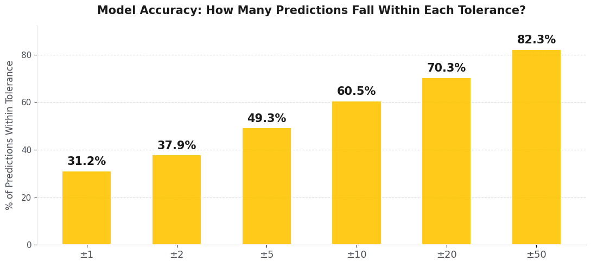
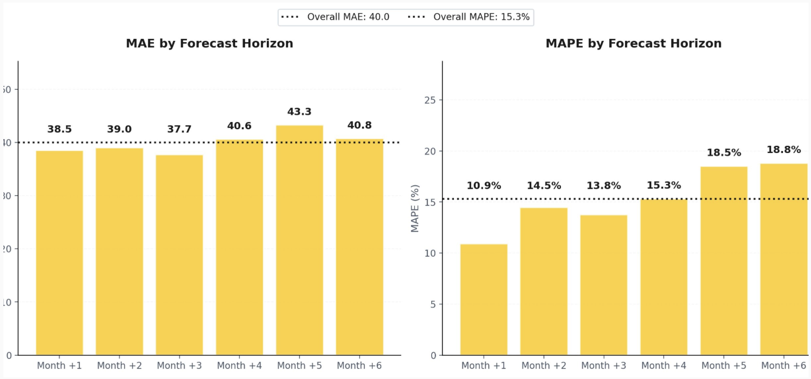

# Temporal Fusion Transformer Supply Chain Forecasting

This repository is a public project summary for a multivariate time-series forecasting workflow built to forecast monthly shipment demand across supplier-part combinations. The public version focuses on the modeling approach, validation design, performance evaluation, baseline context, and operational impact while excluding private datasets, internal paths, credentials, trained checkpoints, and raw notebooks.

## Project Overview

Supply-chain shipment demand is difficult to forecast because many supplier-part series are sparse, intermittent, and volatile. A single standalone model per series can fail when there is not enough history, while simple aggregate models can miss supplier-level and part-level behavior.

The final modeling direction uses a Temporal Fusion Transformer (TFT) with PyTorch Forecasting. The workflow combines:

- Static supplier and part identifiers.
- Known calendar and order-related inputs.
- Past shipment behavior.
- Leakage-safe lag and rolling features.
- Supplier-level, part-level, and global aggregate demand signals.
- A held-out 6-month validation horizon.

The best internal validation run achieved approximately **13.4% WAPE** on the private project dataset. Because the underlying data is confidential, this repository documents the implementation and evaluation workflow without publishing row-level data or trained weights.

## Performance Snapshot

The chart below summarizes an aggregate tolerance-bucket diagnostic: the percentage of predictions that fall within selected absolute-error thresholds. It is included as a public-safe example of how forecast error distribution was communicated; it should not be read as the best internal validation run cited above.



The next figure shows how error changes across the 6-month forecast horizon. This view is useful for checking whether the model degrades as it forecasts farther into the future.



The plot is stored at:

```text
03_model_performance_evaluation/figures/model_accuracy_tolerance_buckets.png
03_model_performance_evaluation/figures/performance_metrics_per_horizon.png
```

Additional plots can be generated with `03_model_performance_evaluation/evaluate_forecasts.py`. By default, that script writes charts such as:

- `accuracy_tolerance_buckets.png`
- `actual_vs_predicted.png`
- `monthly_actual_vs_predicted.png`

These generated outputs should be reviewed before committing. Keep only aggregate, public-safe figures.

## Repository Structure

```text
01_tft_model_implementation/
  train_tft.py
  tft_pipeline_experimental.py

02_model_validation/
  validate_tft_forecasts.py
  validation_strategy.md
  metric_definitions.md
  data_schema.md

03_model_performance_evaluation/
  evaluate_forecasts.py
  figures/

04_project_impact/
  project_impact_summary.md

05_baselines_and_context/
  sarimax_baseline.py
  baseline_summary.md
  clustering_context.md

PUBLICATION_AUDIT.md
requirements.txt
```

## My Contributions

- Implemented and iterated on TFT forecasting pipelines for many related supplier-part time series.
- Built leakage-safe feature engineering with shifted lags and rolling statistics.
- Added hierarchical supplier, part, and global demand signals to improve cross-series learning.
- Designed validation logic around a held-out 6-month forecast horizon.
- Evaluated performance with real-unit error metrics including MAE, horizon-level MAE, nonzero-guarded MAPE, and WAPE.
- Consolidated SARIMAX baseline work into a reusable public baseline script.
- Translated model results into operational planning impact: shortage-risk review, supplier-part prioritization, and monthly planning support.

## Data Requirements

The scripts expect an anonymized monthly dataset with columns similar to:

```text
MONTHYEAR
ORDERED_QTY
QTY_APPLIED
SUPP_CD_HASHED
CAT_ID_NO_HASHED
FAC_CD_HASHED
```

`FAC_CD_HASHED` is optional for scripts that evaluate only supplier-part level series. Do not commit private data. Use anonymized, synthetic, or schema-only examples for public demonstrations.

## Setup

```bash
pip install -r requirements.txt
```

## Run TFT Training

```bash
python3 01_tft_model_implementation/train_tft.py \
  --data path/to/anonymized_monthly_data.csv
```

The training script may create checkpoints, logs, reports, and local plots. Those artifacts are intentionally excluded from the public repository unless a specific aggregate figure has been reviewed for publication.

## Validate Forecasts

Use the standalone validation script when you already have an actuals CSV and a forecast CSV:

```bash
python3 02_model_validation/validate_tft_forecasts.py \
  --actuals path/to/anonymized_actuals.csv \
  --forecasts path/to/tft_forecasts.csv \
  --output validation_summary.csv
```

This produces a CSV summary with overall metrics, inferred horizon metrics, and tolerance-bucket accuracy percentages.

## Evaluate Performance

Use the performance evaluation script to create portfolio-ready aggregate summaries and charts:

```bash
python3 03_model_performance_evaluation/evaluate_forecasts.py \
  --actuals path/to/anonymized_actuals.csv \
  --forecasts path/to/tft_forecasts.csv \
  --output-dir forecast_performance_outputs
```

The evaluator writes:

- `performance_summary.csv`
- `aligned_forecast_actuals.csv`
- `top_absolute_errors.csv`
- `monthly_volume_performance.csv`
- `accuracy_tolerance_buckets.png`
- `actual_vs_predicted.png`
- `monthly_actual_vs_predicted.png`

Review generated CSVs and plots before publishing. Row-level aligned outputs and top-error files should usually remain local unless they are synthetic or fully approved for release.

## Run Baseline Model

```bash
python3 05_baselines_and_context/sarimax_baseline.py \
  --data path/to/anonymized_monthly_data.csv
```

The SARIMAX baseline provides context for why a global deep-learning model is useful in this setting: many supplier-part series are sparse, short, or difficult to model reliably in isolation.

## Validation Design

The TFT validation workflow uses a final 6-month holdout window. Feature engineering avoids target leakage by shifting target-derived lag and rolling features before aggregation. Metrics are computed after reversing the model target transform, so errors are reported in shipment quantity units.

Primary metrics:

- **MAE:** average absolute error in shipment quantity units.
- **Per-horizon MAE:** error by forecast month across the 6-month horizon.
- **MAPE on nonzero actuals:** percentage error with zero-demand protection.
- **WAPE:** volume-weighted aggregate error, used as the main business-facing summary metric.

## Project Impact

This project demonstrates an end-to-end applied forecasting workflow for operational planning. The TFT model supports a 6-month planning horizon, which can help teams identify supplier-part risk areas earlier, prioritize planner attention, and evaluate expected shipment gaps before they become urgent.

The public repo is intentionally organized as a project-summary repository rather than a raw research dump. Each folder has a focused role: implementation, validation, performance evaluation, impact, and baseline context.

## Publication Notes

Before pushing publicly, confirm that the repository does not include:

- Raw CSV, Excel, Parquet, or private data extracts.
- Trained checkpoints or serialized model artifacts.
- TensorBoard, CatBoost, W&B, MLflow, or local experiment logs.
- Notebook outputs with row-level records or internal paths.
- Virtual environments or downloaded third-party source trees.
- Internal filesystem paths, usernames, credentials, tokens, or private project names.

For the safest public release, initialize a fresh Git history after the cleanup and commit only the curated files in this repository.
